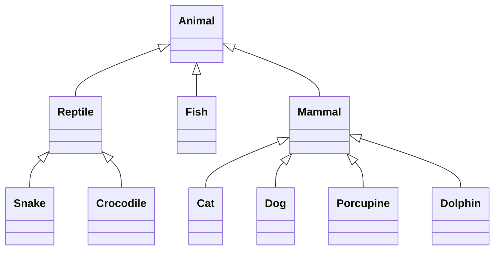

## Dziedziczenie

### Agenda
Przewidywany plan zajęć kształtuje się następująco:
* przedstawienie idei dziedziczenia w kontekście dziedziczonych cech,
* przedstawienie idei dziedziczenia w kontekście polimorfizmu, 
* analiza zadania przykładowego,
* indywidualna praca nad listą zadań.

### Dziedziczenie cech
Oto bardzo prosta reprezentacja samochodu:
```
class Car
{
    public String make
    public String model
    public Integer enginePower
    public Integer mileage
    public Integer weight
}
```

Każdy taki samochód będzie miał przypisaną markę i model, moc silnika, przebieg i wagę. Jednym z podstawowych założeń dziedziczenia w programowaniu obiektowym jest ułatwienie grupowania pewnych funkcjonalności w różnych klasach. Wyobraźmy, że z jakichś powodów chcielibyśmy stworzyć klasę modelującą ciężarówkę:
```
class Truck
{
    public String make
    public String model
    public Integer enginePower
    public Integer mileage
    public Integer weight
}
```

Wyglądają tak samo? Oczywiście można byłoby po prostu stworzyć ciężarówkę konstruktorem samochodu, ale jeżeli byty te mają się jakoś różnić, warto je koncepcyjnie rozdzielić. Tutaj z pomocą przychodzi dziedziczenie:
```
class Truck extends Car
{
}
```

Taki zapis oznacza, że każda ciężarówka będzie miała ("dziedziczyła") te same publiczne lub chronione pola oraz metody co samochód. Zatem jeżeli klasa `Car` ma pole `mileage`, a `Truck` dziedziczy po `Car`, wówczas obiekt stworzony `truck = new Truck()` również będzie miał w sobie pole `mileage`. Jeżeli do klasy `Truck` dopiszemy nowe pola lub metody, będą one dostępne tylko w obiektach opisujących ciężarówki.

Pola i metody w dziedziczonych klasach można też przesłaniać i modyfikować ich zachowania. Dotyczy to zarówno domyślnych wartości pól, sygnatury konstruktora, jak i funkcjonalności metod:
```
class Car
{
    public String make
    public String model
    public Integer enginePower
    public Integer mileage
    public Integer weight
   
    public static String type = "samochód osobowy"
    
    public Boolean canBeDriven(Driver driver) {
        return driver.hasLicence("B");
    }
}

class Truck extends Car
{
    public static String type = "samochód ciężarowy"
    
    public Boolean canBeDriven(Driver driver) {
        return driver.hasLicence("C");
    }
}
```

#### Interludium: Dziedziczenie wielokrotne
W Javie, PHP czy w C# można dziedziczyć tylko po jednej klasie. Niektóre języki - tutaj trzeba wymienić z najpopularniejszych C++ oraz Pythona - oferują możliwość dziedziczenia po wielu klasach. Warto to wiedzieć, natomiast ten kurs nie będzie zgłębiał tajników i problemów wielokrotnego dziedziczenia.

### Polimorfizm
Oprócz "przejmowania od rodzica" pól i metod dziedziczenie pozwala na jeszcze jedną bardzo ważną rzecz. Żeby zrozumieć podstawy polimorfizmu, trzeba zastanowić się jeszcze raz skąd w ogóle wzięło się programowanie obiektowe. Wiemy już, że jest to świetna metoda do modelowania rzeczywistego świata w programach komputerowych, ale do tej pory skupialiśmy się na wartościach i czynnościach obiektów, czyli polach i metodach. Obiekty można natomiast wykorzystać jeszcze w jeden sposób: identyfikować je na podstawie klasy, z której zostały zbudowane.

Robiliśmy to już w bardzo prosty sposób na poprzednich zajęciach. Jeżeli metoda `attack()` w laboratorium 3 przyjmowała obiekt klasy `Player` to wiedzieliśmy, że musimy tam włożyć utworzony obiekt klasy `Player`. Dziedziczenie tę identyfikowalność rozszerza o relacje. Jeżeli jakaś klasa dziedziczyłaby po klasie `Player`, wówczas obiekt takiej klasy również mógłby zostać wykorzystany w metodzie `attack()`. 

Najłatwiej to zapamiętać analogią do świata zwierząt:
```
class Animal {}
class Mammal extends Animal {}
class Reptile extends Animal {}
class Fish extends Animal {}
class Cat extends Mammal {}
class Dog extends Mammal {}
class Porcupine extends Mammal {}
class Snake extends Reptile {}
class Crocodile extends Reptile {}
```

Diagram UML tych relacji mógłby wyglądać następująco:


Każdy kot (`Cat`) jest zarówno ssakiem (`Mammal`), jak i zwierzęciem (`Animal`). A więc:
* jeżeli jakaś metoda będzie oczekiwała obiektu typu `Mammal`, będziemy mogli do niej przekazać dowolną instancję klasy `Mammal` lub jakiejkolwiek klasy, która po niej dziedziczy, czyli na przykład kota
* jeżeli metoda będzie oczekiwać obiektu typu `Cat`, wówczas przekażemy do niej tylko instancje kota (lub czegoś, co dziedziczy po `Cat`)
* jeżeli klasa `Animal` będzie miała publiczne pole `numberOfLegs` to każdy klasa dziedzicząca po niej również będzie miała takie pole u siebie; warto się wtedy zastanowić czy dla ssaków nie ustawić domyślnej wartości (`numberOfLegs = 4`) innej niż na przykład dla ryb (`numberOfLegs = 0`)
* warto tutaj się zastanowić nad klasyczną logiką; jeżeli klasa `Fish` implementuje metodą `swim()` to oznacza na pewno to, że każda ryba (czyli obiekt klasy dziedziczącej po `Fish`) będzie umiała pływać, ale nie oznacza w żadnym wypadku, że nikt poza rybami nie umie pływać; klasa `Dolphin` nie dziedziczy po `Fish`, ale może implementować `swim()` w swoim własnym zakresie

### Analiza przykładowego zadania
Zadanie składa się z dwóch części: klas opisujących różne pojazdy oraz głównej funkcji programu, która sprawdza ile kosztuje bilet wjazdu na parking dla danego pojazdu. Tym razem każda klasa jest opisana w osobnym pliku, czyli w sposób w jaki raczej się programuje na poważnie:
```
class Car
{
    protected String name
    
    public Car(String name) {
        this.name = name
    }
    
    public Car(String name) {
        this.name = name
    }

    public String getName() {
        return "{this.getType()} {this.name}"
    }

    protected String getType() {
        return "samochód osobowy"
    }
}

class Truck extends Car
{
    public Truck(String name) {
        super(name)
    }
    
    protected String getType() {
        return "samochód dostawczy"
    }
}

function Decimal getPayment(Car car):
    return switch(car.getClassName()) {
        Truck::class -> 5.0,
        default -> 4.0,
    }


Collection<Car> vehicles = [
    Car("Volkswagen Passat"),
    Truck("Volkswagen Transporter"),
]

foreach(Car vehicle in vehicles) {
    print "{vehicle.getName()}: {getPayment(vehicle)}zł"
}
```

Zadanie powinno być zrozumiałe przez wszystkich. Kolejno:
* tworzony jest zbiór pojazdów składający się zarówno z samochodów klasy `Car`, jak i ciężarówek klasy `Truck` dziedziczącej po klasie `Car`;
* wszystkie pojazdy zostają wypisane wraz z ceną wedle cennika zamodelowanego funkcją `getPayment()`;

W każdym języku będzie to wyglądało nieco inaczej, ale warto zwrócić uwagę na pewne niuanse:
* Java i Python mają słowo kluczowe `super()`, które wywołuje konstruktor klasy nadrzędnej; w PHP jest on domyślnie przepisany z rodzica
* operator `match` różnie działa w różnych językach: w PHP wywołany zostanie `case`, który spełnia warunek przekazany jako parametr `match()`; w Javie zadziała nieco inaczej, ponieważ będzie rzutował parametr `match()` na opisany typem i zmienną `case`; natomiast w Pythonie konstrukcja w ogóle nie istnieje

### Zadanie do wykonania
Należy rozszerzyć program o następujące funkcjonalności:
* cennik powinien obsługiwać nową klasę przedstawiającą kampera; instancja nowej klasy powinna być dodana w głównym pliku do zbioru pojazdów do wypisania
* każdy pojazd powinien mieć swoją tablicę rejestracyjną
* cennik, najlepiej jako obiekt nowej klasy, powinien mieć rejestr tablic rejestracyjnych, które wjeżdżają za darmo, bez względu na rodzaj samochodu
* wypisywanie pojazdów powinno teraz wypisać nie tylko typ pojazdu i cenę, ale również numer rejestracyjny

Wykonane zadanie należy dodać do swojego repozytorium w katalogu `lab05`.

### Uruchamianie zadań
Wszystkie narzędzia są skonteneryzowane i gotowe do użycia bezpośrednio poprzez Dockera. Chętni studenci mogą oczywiście uruchamiać zadania w środowiskach lokalnych.

#### Java
```
docker compose run java javac ./exercises/lab05/java/Main.java ./exercises/lab05/java/lab05/*.java
docker compose run java java -cp ./exercises/lab05/java Main
```

#### PHP
Tym razem przed uruchomieniem programu należy zbudować autoloader; dzięki niemu wszystkie pliki w katalogu `exercises/lab05/php/src` będą automatycznie dodawane do projektu i nie trzeba będzie ich ręcznie dodawać przez polecenie `require`:
```
docker compose run php composer install --working-dir=./exercises/lab05/php
docker compose run php php ./exercises/lab05/php/index.php
```

#### Python
```
docker compose run python python ./exercises/lab05/python/main.py
```
